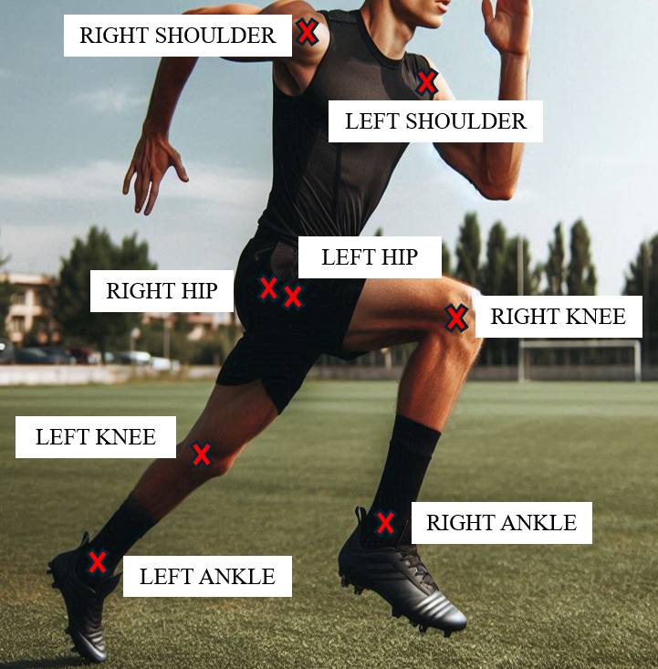

# VideoRun2D

***
# About
We present VideoRun2D, a new markerless biomechanic sprint analysis system based on deep learning models. mEBAL is a database which is initially introduced in [arXiv technical report]() and then accepted by the [Conference sended](). 

https://github.com/user-attachments/assets/de87e72c-eb38-419e-bee8-2c8f09b4525c

Our proposed VideoRun2D performs markerless body tracking and estimates the joint angles of each user during a sprint. To achieve effective estimation, the VideoRun2D system comprises five processing modules: video pre-processing, tracking of the articular points, tracking post-processing, biomechanical features generation, and a validation system that employs statistical analysis. 

Figure [1](./media/Diagrama.png) shows a diagram of the proposed VideoRun2D system.

# Motivation

Sprinting is a determinant ability, especially in team sports. The kinematics of the sprint have been studied in the past using different methods specially developed considering human biomechanics and, among those methods, markerless systems stand out as very cost-effective. On the other hand, we have now multiple general methods for pixel and body tracking based on recent machine learning breakthroughs with excellent performance in body tracking, but these excellent trackers do not generally consider realistic human biomechanics (like the ones considered in support for professional sports or injury rehabilitation). This investigation first adapts two of these general trackers (MoveNet and CoTracker) for realistic biomechanical analysis and then evaluate them as methods in comparison to manual labeling one (Kinovea). 

# Database

## Data adquisition

Five healthy amateur soccer players are analyzed (23±3.74 years old, 77.2±6.8 kg weight, 181.8±6.3 cm height). All of them signed an informed consent. The investigation was approved by the Ethics Committee of the University following the Declaration of Helsinki.

The sprints were recorded using a video camera Panasonic DMC FZ-1000 with a resolution of $1920\times1080$p and recorded at 100 fps in two different outdoor scenarios. Each subject performed eight sprints of 20m while the camera recorded between the 5th and 15th m. The camera was placed 10 m from the middle point of the sprint. All the players sprinted with football boots on a natural grass field. Between each sprint, the players had 5 minutes of rest. A total of 40 sprints and 240 running strides were generated.

## Ground truth based on manual labeling (Kinovea)

Three experts previously trained manually marked all the images using the freeware Kinovea (version 0.9.5); these marks are used as ground truth. The main instruction given to the experts was to mark the different points on the joint centers (shoulder, hip, knee, and ankle). Figure [2](./media/JointPoints.png) shows each location of the joint point marked manually. 

For the body parts covered by other segments, the experts were instructed to mark the anatomical points as if the different body parts covering others were transparent. These points were marked in every frame of each video. When all the frames were labeled, the trajectory of each joint was revised to find and correct possible marking mistakes.

# Instructions for Downloading VideoRun2D

Under construction

# References

+ [1] Garrido-Lopez, G.; Gomez, L.F; Fierrez, J.; Morales, A.; Tolosana R.; Rueda, J. and Navarro E. 2020. VideoRun2D: Cost-Effective Markerless Motion Capture. Under review in ***. [[pdf](https://arxiv.org/)]

# Contact:

For more information contact Aythami Morales, associate professor UAM at aythami.morales@uam.es

